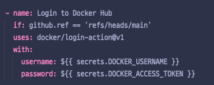
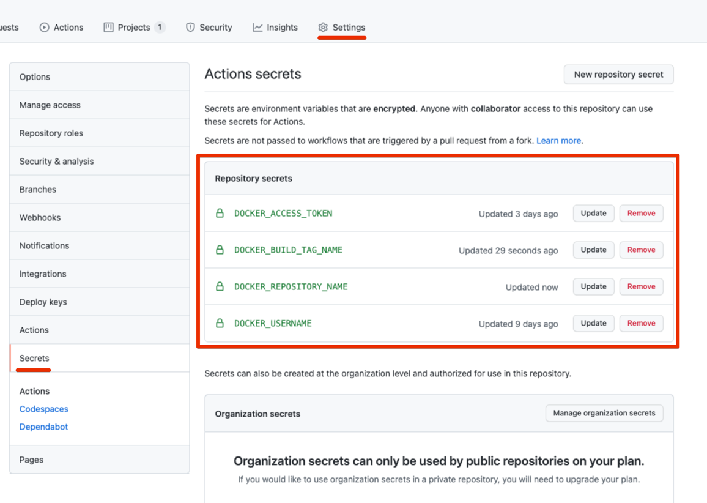
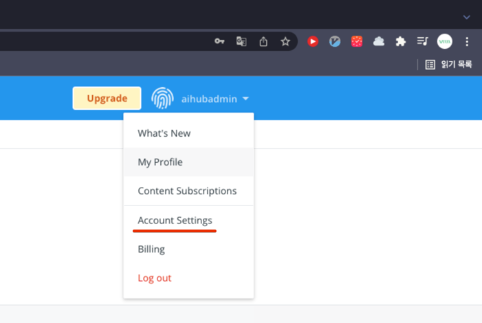
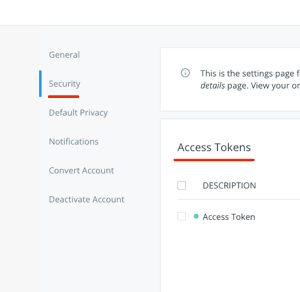

# ci

github actions 관련 ci 구축 내용을 정리한 문서입니다.

### 흐름

ci 설정은 `.gihtub/workflow/ci.yml` 파일에 작성되어 있습니다.

- main 브랜치에 push 혹은 pull_request 진행 시에 진행됩니다.
- 기본적으로 gradle `build`, `test`를 수행합니다.
- **ci가 실행되는 브랜치가 main 일때만 docker `build`, `push`를 추가로 진행합니다.**
  - `if: github.ref == 'refs/heads/main'`
  - docker push가 진행되면 도커 이미지 저장소에 이미지가 업로드 됩니다.

배포 준비만을 진행하는 과정이며, 실제 배포는 서버에 접속해 도커 이미지를 다운받고 재실행 해야 합니다.

### Secrets

현재 몇가지 설정들을 `secrets`에서 가져오고 있습니다.  

만약 이 설정들이 바뀔 경우, Secrets 탭에서 해당 내용을 수정해야 합니다.

사용중인 secrets은 다음과 같습니다.

- DOCKER_USERNAME
  - `Docker Hub`의 유저 이름
- DOCKER_ACCESS_TOKEN
  
  
  - `Account Settings` - `Security` - `Access Tokens`에서 발급한 키를 사용합니다.
- DOCKER_BUILD_TAG_NAME
  - 도커 이미지를 빌드할 때 사용할 태그 이름입니다.
- DOCKER_REPOSITORY_NAME
  - `Docker Hub`의 저장소 이름입니다.

### 추가 참고 사항

도커에 관한 배포 관련 설정은 다른 서비스 ( [NCP Container Registry](https://www.ncloud.com/product/compute/containerRegistry) ) 로 바꾸게 될
경우 배포 과정이 많이 바뀔 수 있습니다.
